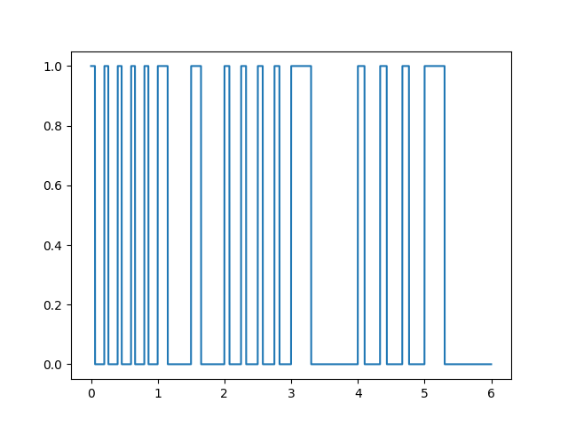
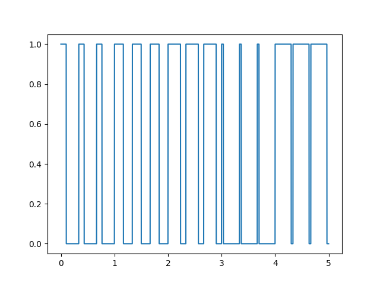

# Uruchomienie i skonfigurowanie OpenWRT dla maszyny wirtualnej i uruchomienie na qemu

1. Pobieramy obraz systemu operacyjnego i systemu plików, rozpakowujemy go:
   ```
   wget https://downloads.openwrt.org/releases/21.02.1/targets/armvirt/64/openwrt-21.02.1-armvirt-64-Image -O Image
   wget https://downloads.openwrt.org/releases/21.02.1/targets/armvirt/64/openwrt-21.02.1-armvirt-64-rootfs-ext4.img.gz -O rootfs.ext4.gz
   gunzip rootfs.ext4.gz
   ```
2. Uruchamiamy system:
   ```
   qemu-system-aarch64 -M virt -nographic \
	-m 128 \
	-cpu cortex-a57 -smp 2 \
	-kernel Image -append "root=fe00" \
	-drive file=rootfs.ext4,if=none,format=raw,id=hd0 \
	-device virtio-blk-device,drive=hd0 \
	-nic user,hostfwd=tcp::8889-:80,hostfwd=tcp::8888-:22
   ```
3. Edytujemy plik `/etc/config/network`
   ```
    #config device
    #       option name 'br-lan'
    #       option type 'bridge'
    #       list ports 'eth0'

    config interface 'lan'
        option device 'br-lan'
        option proto 'dhcp'
    #       option ipaddr '192.168.1.1'
    #       option netmask '255.255.255.0'
    #       option ip6assign '60'
   ```
4. Restartujemy sieć: `/etc/init.d/network reload`

# Implementacja w języku Python oraz uruchomienie w OpenWRT / qemu dwóch programów generujących sygnał PWM

## Kopiowanie skryptów na OpenWRT
1. Aktualizujemy pakiety oraz instalujemy Pythona3:
   `opkg update && opkg install python3`
2. Z poziomu hosta przesyamy programy generujce sygnały pwm:
   `scp -P 8888 pwm*.py "root@localhost:~"`

## Generowanie sygnału PWM

### Sygnał o zmiennej częstotliwości, wypełnienie 30%


### Sygnał o zmiennym wypełnieniu, częstotliwość 3Hz

