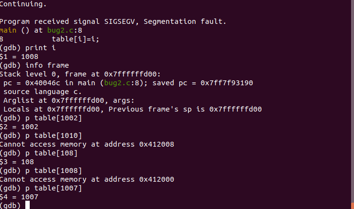

# Systemy komputerowe w sterowaniu i pomiarach (SKPS) - Lab 3

## SDK
1. `wget https://downloads.openwrt.org/releases/21.02.1/targets/bcm27xx/bcm2711/openwrt-sdk-21.02.1-bcm27xx-bcm2711_gcc-8.4.0_musl.Linux-x86_64.tar.xz`
2. `tar -xaf openwrt-sdk-21.02.1-bcm27xx-bcm2711_gcc-8.4.0_musl.Linux-x86_64.tar.xz`
3. `make menuconfig`
    - W `Global Build Settings` wyłączamy
        - Select all target specific packages by default
        - Select all kernel module packages by default
        - Select all userspace packages by default
        - Cryptographically sign package lists
    - W `Advanced configuration options` wyłączamy `Automatic removal of build directories`
## 1. Pierwszy pakiet
1. `cd ..`
2. `https://moodle.usos.pw.edu.pl/pluginfile.php/217384/mod_folder/content/0/WZ_W03_przyklady.tar.xz` - pobranie pakietu
3. `tar -xaf WZ_W03_przyklady.tar.xz`
4. `cd openwrt-sdk`
5. `export LANG=C`
6. `nano feeds.conf.default`
    ```
    src-link skps /home/user/skps22_sztanga_stelmakh/lab3/demo1_owrt_pkg
    ```
7.
    ```
    ./scripts/feeds update -a
    ./scripts/feeds install -p skps -a
    ```
8. `make menuconfig`
    - W `Examples` zaznaczamy
        - demo1
        - demo1mak
9.
    ```
    make package/feeds/skps/demo1/compile
    ```
10. `cd bin/packages/aarch64_cortex-a72/skps`
11. Przeniesiono pliki na OpenWRT
12. Instalujemy pakiety na OpenWRT:
    ```
    opkg install demo1_1.0-1_aarch64_cortex-a72.ipk
    ```

## 2. Pakiety worms i buggy
- Pobrano i rozpakowano `WZ_W03_przyklad_extbr.tar.xz`.
- Do obu pakietów na poziomie katalogu `src` został skopiowany Makefile z zadania pierwszego.
- Do Makefile pakietu `worms` zostało dodane `dependens: +libncurses`.
- Do Makefile pakietu `buggy` została dodana flaga debuggera `TARGET_CFLAGS += -ggdb3`.
- Wygenerowano plik `.ipk` i przeniesiono go na Raspberry.
- Za pomocą `opkg install` zainstalowano oba pakiety.

Po uruchomieniu gra `worms` (a właściwie snake) działała poprawnie. Programy `bug1`, `bug2`, `bug3` miały błędy w kodzie źródłowym.

## 3. Debugowanie zdalne
- Używając `opkg` zainstalowano `gdb` oraz `gdbserver` na RaspberryPi.
- Uruchomiono serwer:
  ```
  gdb-server localhost:8000 bug1
  ```
- Na komputerze zaś połączono się z serwerem gdb poprzez polecenie:
  ```
  ./scripts/remote-gdb 10.42.0.156:8000
  ```

### Bug1
- Użyto polecenia `directory` by wskazać debugerowi pliki źródłowe.
- Ustawiono `breakpoint` na funkcji `main`.
- Wykonano zaledwie jeden krok i program zgłosił błąd.
- Po wyświetlaniu wartości pętli widać, że stało się to przy pierwszym wykonaniu.


Wnioskujemy, że tablica do której są wpisywane wartości nie została zainicjowana.

### Bug2
- Użyto polecenia `directory` by wskazać debugerowi pliki źródłowe.
- Ustawiono `breakpoint` na funkcji `main` a następnie kontynuowano.
- Program zatrzymał się na błędzie.
- Używając polecenia `print` sprawdziliśmy które to wykonanie pętli.

Naszą teorią było, że pętla wykracza poza zakres tablicy i w 1008 iteracji trafia na pamięć do której nie ma dostępu.

Sprawdzono to więc testując kilka różnych pozycji w tablicy.


Wykonano również `backtrace`.


### Bug3
- Użyto polecenia `directory` by wskazać debugerowi pliki źródłowe.
- Ustawiono `breakpoint` na funkcji `main` a następnie kontynuowano.
- Program po uruchomieniu dawał dziwne wyniki. Z kodu wynikałoby, że tablica `s2` nie jest nigdy
modyfikowana, a jednak jej wartość nie równała się początkowej.
- Ustawiliśmy więc `watchpoint` na początek drugiej tablicy by sprawdzić kiedy zaczyna być modyfikowana.
- Kiedy debuger wykrył zmianę wartości `s2[0]` zatrzymał wykonywanie.
- Sprawdziliśmy numer iteracji. Iterator pętli wynosił **11**.


Doszliśmy do wniosku, że to od tego momentu s2 zaczyna być niezamierzenie modyfikowane.
