# Systemy komputerowe w sterowaniu i pomiarach (SKPS) - Lab 4

## Zadanie 1
Pobrano pakiet `openWRT` z przygotowanym do zajec proramem spod linku:
```
https://moodle.usos.pw.edu.pl/pluginfile.php/241562/mod_folder/content/0/skps_lab4_student.tar.xz?forcedownload=1
```
Zbudowano program na komputerze host i zobaczono, że działa.

## Zadanie 2
Skompilowano pakiet i zainstalowano go na `OpenWRT`.

## Zadanie 3
Zmodyfikowano liczbę dostępnych rdzeni i sprawdzono poprawność konfiguracji poleceniem:
```
stress-ng –matrix 0 -t 30s & htop
```
Metodą inżynierską oszacowano graniczne wartości.
- Wariant 1: 200000
- Wariant 2: 350000
- Wariant 3: 700000
- Wariant 4: 800000

By uzyskać pełne obciążenie wykonano w tle komendę:
```
stress-ng --matrix 0 -t 1m
```

### Działający jeden rdzeń
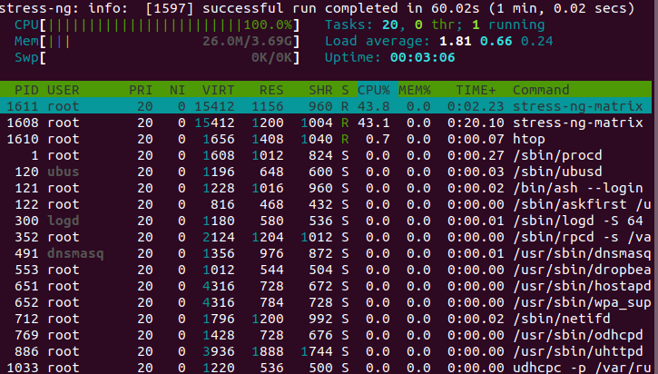

### Pełne obciążenie na 1 rdzeń
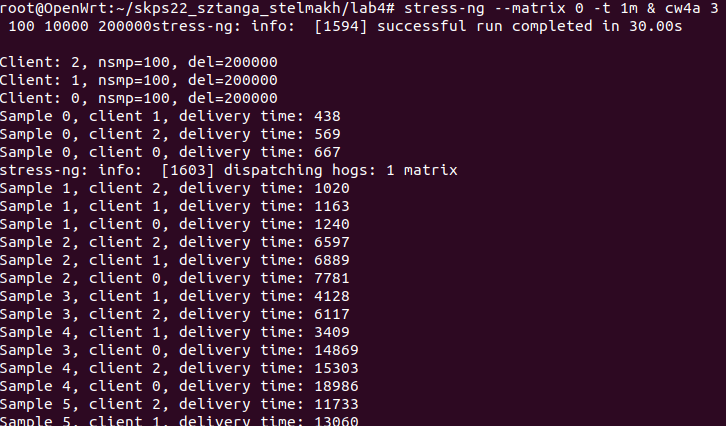

### Uruchomienie bez obciążenia dla 2 rdzeni
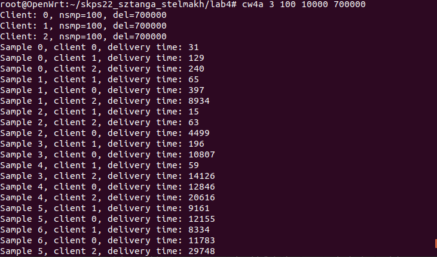

### Działające tylko 2 z 4 rdzeni
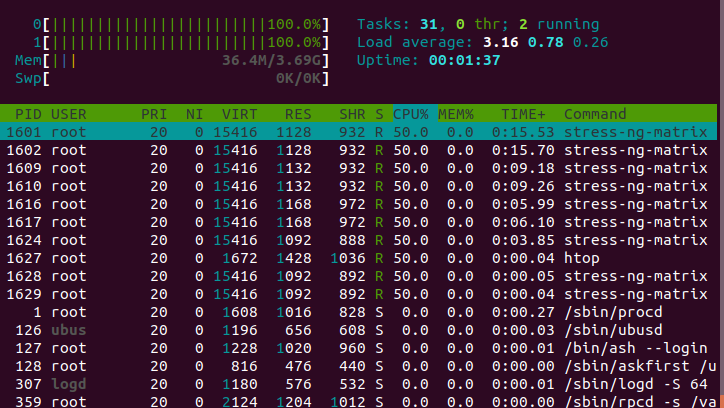

### Działające 4 rdzenie
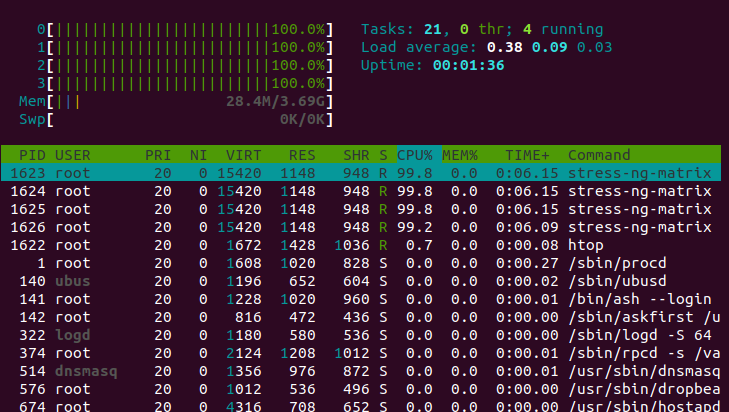

### Uruchomienie bez obciążenia dla 4 rdzeni
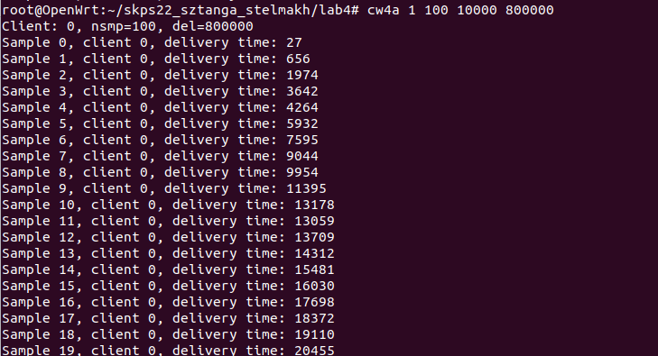

## Zadanie 4
Wykonano testy dla wszystkich wariantów zadania 3 używając połowy wyznaczonej wartości
granicznej czasu przetwarzania. Wyniki umieszczono w histogramie. Do wygenerowania
histogramów użyto pythona z biblioteką matplotlib. Przedział osiąganych wartości został
podzielony na 20 części. Słupki dla wariantów 1, 2 i 3 są 3 razy węższe niż dla wariantu 4, by
klienci się nawzajem nie zasłaniali.

### Wariant 1
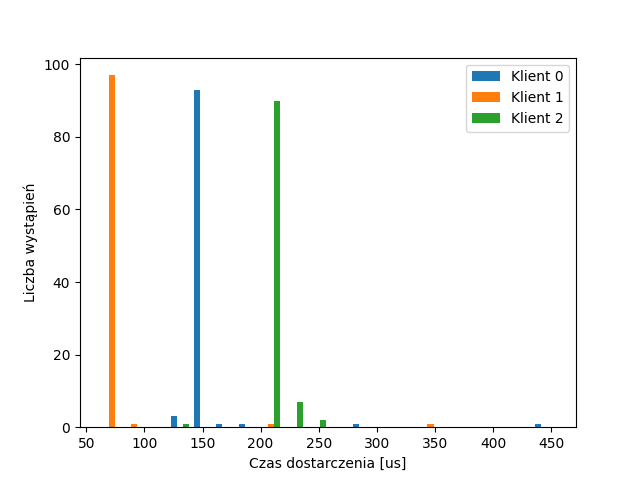

### Wariant 2
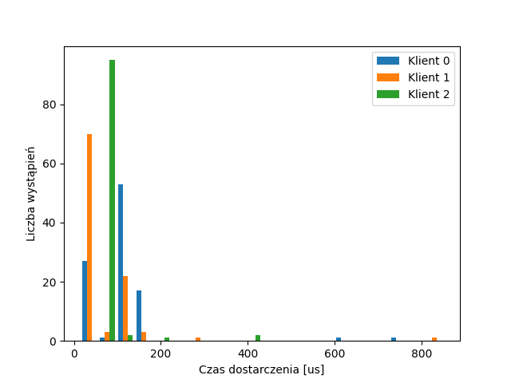

### Wariant 3
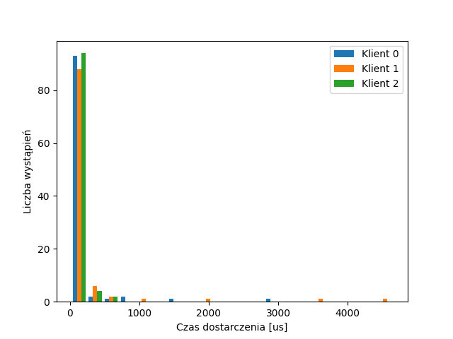

### Wariant 4
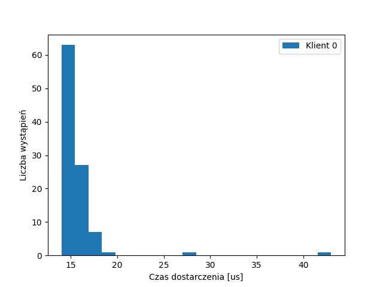

### Wnioski
Jak widać histogramy są najgęstsze z lewej strony. Te niewielkie słupki po prawej oznaczają
pojedyncze duże czasy oczekiwania.

## Zadanie 5
Przeprowadzono nowe doświadczenie mające sprawdzić wpływ zmiany usypiania procesu na
aktywne oczekiwanie. Przeprowadzono doświadczenie dla 3 klientów, **okresu próbkowania 20000** i
**4 rdzeni** **bez dodatkowego obciążenia**. Wygenerowano histogramy używając tego samego skryptu w
pythonie.

### Usypianie procesu
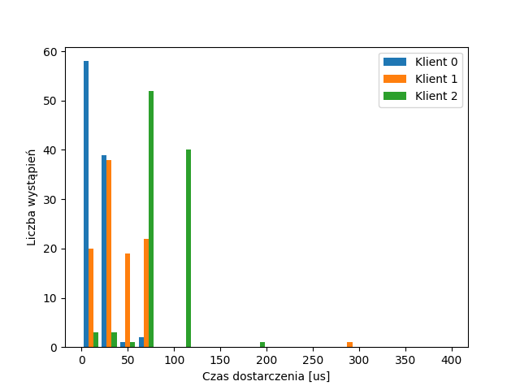

### Aktywnie oczekujący klient 0 i usypiani klienci 1 i 2
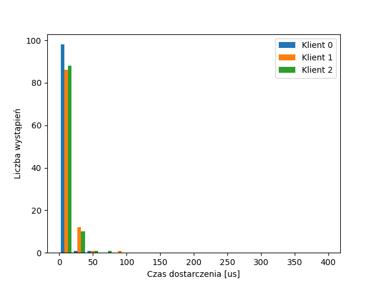

### Aktywnie oczekujący wszyscy klienci
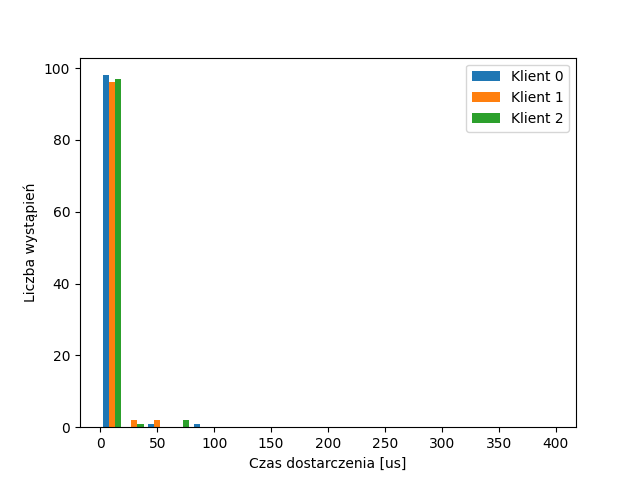

### Wnioski
Aktywne oczekiwanie sprawiło, że klienci krócej oczekują na odpowiedź. Dzieje się tak gdyż czas
nie jest tracony na przełączaniu procesów.

## Zadanie 6
Ta implementacja nie jest poprawna. Poprawna implementacja opierałaby się na timerach.

### Porównanie timerów
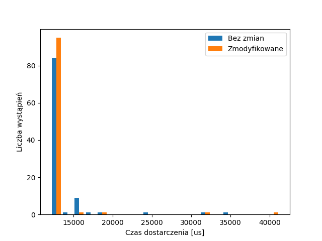