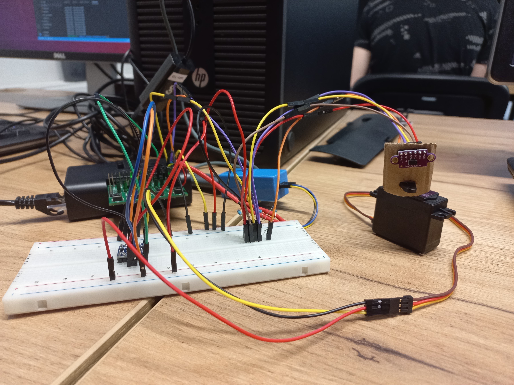
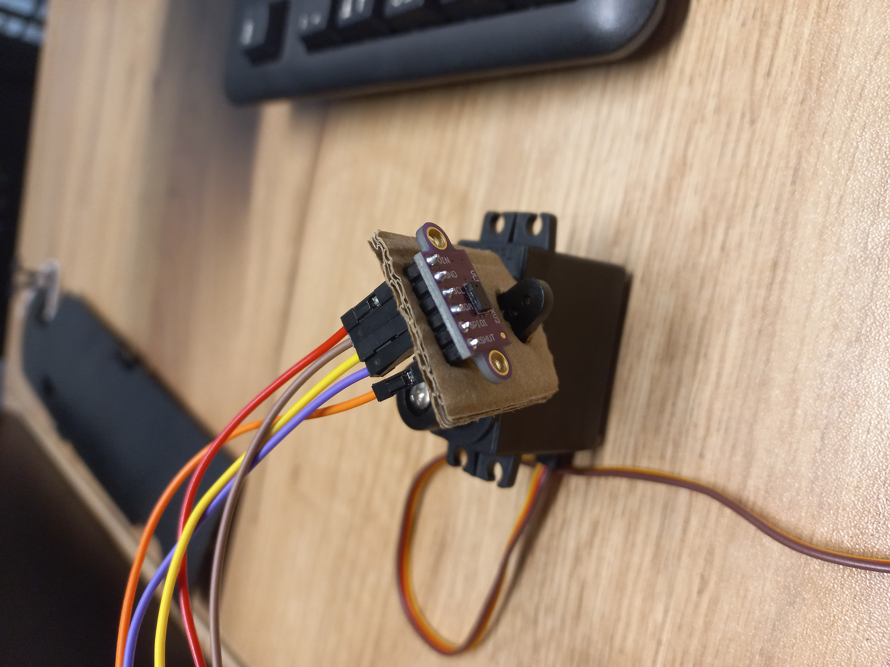
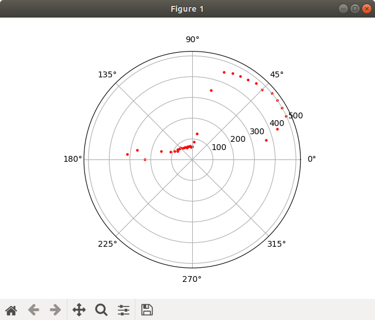
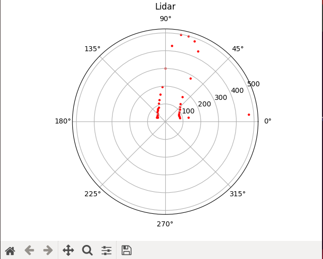
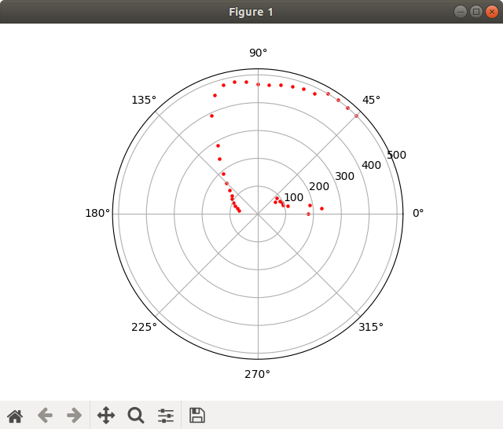

# Systemy komputerowe w sterowaniu i pomiarach - Lab 5 i 6 (Projekt)

## Wybrany temat
Lidar na bazie czujnika odległości ToF i serwomechanizmu

## Opis działania

Program przedstawia sobą nieskończoną pętlę:

1. Mierzenie odległości.
2. Wysyłanie wyników za pomocą kolejki komunikatów.
3. Odczyt wyników za pomocą kolejki komunikatów.
4. Wysyłanie wyników do komputera za pomocą protokołu UDP.
5. Wizualizacja wyniku na wykresie.
6. Obrót serwomechanizmu o kilka stopni.
7. Jeśli przeskanowano 180 stopni -> czyszczenie wykresu oraz zmiana kierunku serwomechanizmu.

## Schemat

## Uruchomienie pakietu na qemu
Zostały zbudowane pakiety dla rpi oraz dla armvirt. Ostatni został uruchomiony na qemu, ale z powodu braku sprzętu zakończył się błędem.

## Połączenie
Czujnik został umieszczony na ramieniu serwa. Kiedy serwo skanowało obszar w zakresie 180
stopni, czujnik zbierał pomiary co 5 stopni.

## Wyniki

