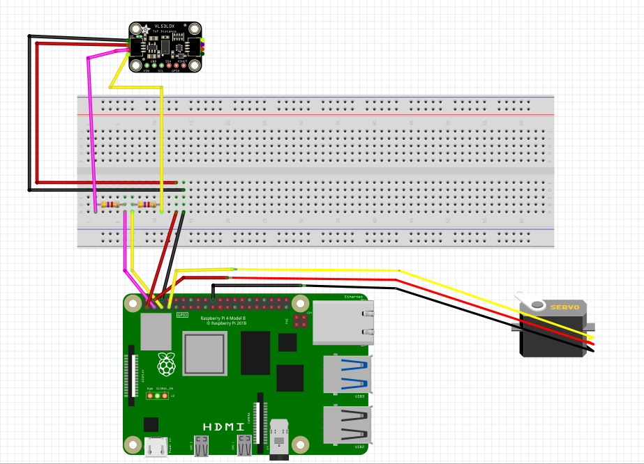

# Systemy komputerowe w sterowaniu i pomiarach - laboratorium 5 i 6

## Wybrany temat
Lidar na bazie czujnika odległości ToF i serwomechanizmu

## Opis działania

Pakiet zawiera dwa pliki:
- `main`

  Steruje serwomechanizmem, obracając go i wykonując pomiary odległości za pomocą urządzenia ToF. Każdy pomiar zostaje zapisany do kolejki komunikatów.
- `rpi_to_host`

  Ciągle odbiera pomiary z kolejki komunikatów i za pomocą protokołu UDP wysyła ich do komputera.

Rolę hosta pełni program `client.py`, który za pomocą protokołu UDP odbiera pomiary i wizualizuje ich w czasie rzeczywistym.

## Schemat

## Uruchomienie pakietu na qemu
Zostały zbudowane pakiety dla rpi oraz dla armvirt. Ostatni został uruchomiony na qemu, ale z powodu braku sprzętu zakończył się błędem.