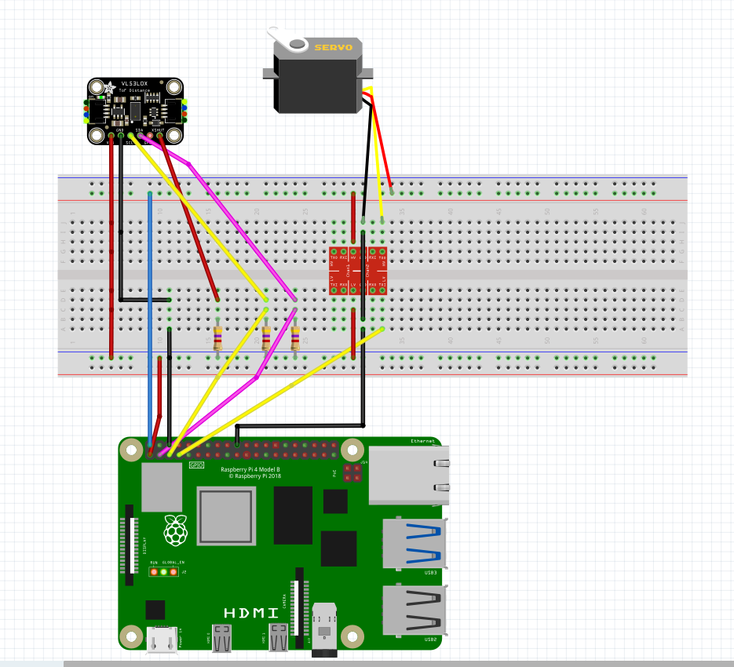
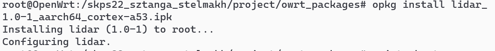

# Systemy komputerowe w sterowaniu i pomiarach - laboratorium 5 i 6

## Wybrany temat
Lidar na bazie czujnika odległości ToF i serwomechanizmu

## Opis działania

Program przedstawia sobą nieskończoną pętlę:

1. Mierzenie odległości.
2. Wysyłanie wyników za pomocą kolejki komunikatów.
3. Odczyt wyników za pomocą kolejki komunikatów.
4. Wysyłanie wyników do komputera za pomocą protokołu UDP.
5. Obrót serwomechanizmu o kilka stopni.

## Schemat

## Uruchomienie pakietu na qemu
Zostały zbudowane pakiety dla rpi oraz dla armvirt. Ostatni został uruchomiony na qemu, ale z powodu braku sprzętu zakończył się błędem.

